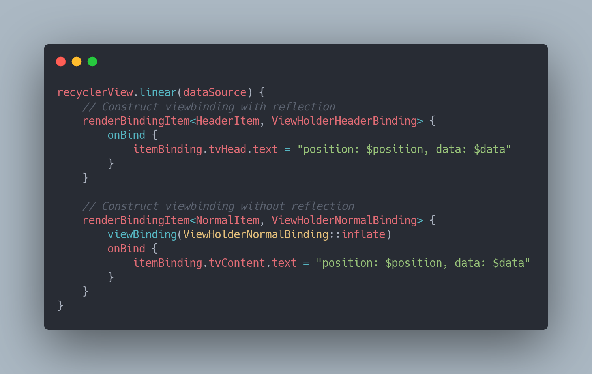

[](https://jitpack.io/#ssseasonnn/Yasha)

*Read this in other languages: [中文](README.zh.md), [English](README.md), [Changelog](CHANGELOG.md)*

# Yasha





## Prepare

1. Add jitpack to build.gradle
```gradle
allprojects {
    repositories {
        ...
        maven { url 'https://jitpack.io' }
    }
}
```

2. Add dependency

```gradle
dependencies {
	implementation 'com.github.ssseasonnn:Yasha:1.1.3'
}
```


## First Blood

How many steps are there to render a RecyclerView?

```kotlin

//Define data type
class NormalItem(val i: Int, val text: String = "") : YashaItem

//Create DataSource and add data
val dataSource = YashaDataSource()
val items = mutableListOf<YashaItem>()
for (i in 0 until 10) {
    items.add(NormalItem(i))
}
dataSource.addItems(items)

//Render Item
recyclerView.linear(dataSource){
    // Use reflection to construct ViewBinding
    renderBindingItem<NormalItem, ViewHolderNormalBinding> {
        onBind {
            itemBinding.tvNormalContent.text = "position: $position, data: $data"
        }
    }
    // or
    // Do not use reflection to construct ViewBinding
    renderBindingItem<NormalItem, ViewHolderNormalBinding>() {
        viewBinding(ViewHolderNormalBinding::inflate)
        onBind {
            itemBinding.tvNormalContent.text = "position: $position, data: $data"
        }
    }
}
```

> When using reflection to create a ViewBinding, add the following proguard rule:

```pro
-keepclassmembers class * implements androidx.viewbinding.ViewBinding {
    public static ** inflate(...);
}
```

## Double Kill

Pagination？Easy!

```kotlin
// Inherit YashaDataSource and rewrite the **loadInitial** and **loadAfter** methods
class CustomDataSource(coroutineScope: CoroutineScope) : YashaDataSource(coroutineScope) {
    var page = 0

    // Called when initial loading, located in the IO thread
    override suspend fun loadInitial(): List<YashaItem>? {
        page = 0
    
        val items = mutableListOf<YashaItem>()
        for (i in 0 until 10) {
            items.add(NormalItem(i))
        }

        // Return null to trigger loading failure
        // Return to empty list to trigger no more
        return items
    }

    // Called when the page is loaded, located in the IO thread
    override suspend fun loadAfter(): List<YashaItem>? {
        page++

        //Simulated loading failed
        if (page % 5 == 0) {
            // Return null to trigger loading failure
            return null  
        }

        val items = mutableListOf<YashaItem>()
        for (i in 0 until 10) {
            items.add(NormalItem(i))
        }

        // Return to empty list to trigger no more
        return items
    }
}
```

> You only need to define the logic of initial loading and paging loading, Yasha will automatically call it at the right time, and you can be a handy shopkeeper with peace of mind.

## Triple Kill

Multiple viewTypes? Little case

```kotlin

//Define data type A
class AItem(val i: Int) : YashaItem

//Define data type B
class BItem(val i:Int) : YashaItem

//Add different types of data
val dataSource = YashaDataSource()
val items = mutableListOf<YashaItem>()
for (i in 0 until 5) {
    items.add(AItem(i))
}
for (i in 5 until 10){
    items.add(BItem(i))
}
dataSource.addItems(items)

//Render Item
recyclerView.linear(dataSource){
    //Render AItem
    renderBindingItem<AItem, AItemBinding> {
        onBind {
            //render
            ...
        }
    }
    //Render BItem
    renderBindingItem<BItem, BItemBinding> {
        onBind {
            //render
            ...
        }
    }
}
```

Header and Footer? No problem, DataSource supports

```kotlin
//Headers
fun addHeader(t: T, position: Int = -1, delay: Boolean = false)
fun addHeaders(list: List<T>, position: Int = -1, delay: Boolean = false) 
fun removeHeader(t: T, delay: Boolean = false) 
fun setHeader(old: T, new: T, delay: Boolean = false)
fun getHeader(position: Int): T
fun clearHeader(delay: Boolean = false)

//Footers
fun addFooter(t: T, position: Int = -1, delay: Boolean = false)
fun addFooters(list: List<T>, position: Int = -1, delay: Boolean = false) 
fun removeFooter(t: T, delay: Boolean = false) 
fun setFooter(old: T, new: T, delay: Boolean = false)
fun getFooter(position: Int): T
fun clearFooter(delay: Boolean = false)
```

## Ultra kill

Partial refresh? Look down

```kotlin
//When defining the data type, override the Diff method
class NormalItem(val i: Int, val text: String = "") : YashaItem {

    override fun areItemsTheSame(other: Differ): Boolean {
        if (other !is NormalItem) return false
        return other.i == i
    }

    override fun areContentsTheSame(other: Differ): Boolean {
        if (other !is NormalItem) return false
        return other.text == text
    }

    //Set the payload
    override fun getChangePayload(other: Differ): Any? {
        if (other !is NormalItem) return null
        return other.text 
    }
}

//dataSource updates the new Item data
val oldItem = NormalItem(1, "1")
val newItem = NormalItem(2, "2")
dataSource.setItem(oldItem, newItem)

// Register onBindPayload when rendering
recyclerView.linear(dataSource){
    renderBindingItem<NormalItem, ViewHolderNormalBinding> {
        onBind {
            itemBinding.tvNormalContent.text = "position: $position, data: $data"
        }
        onBindPayload {
            //Take out the payload for partial refresh
            val payload = it[0]
            if (payload != null) {
                itemBinding.tvNormalContent.text = payload.toString()
            }
        }
    }
}
```

## Rampage

Loading status?

```kotlin
//Use the default loading state
val dataSource = YashaDataSource(enableDefaultState = true)

//or
//Custom loading status
class CustomStateItem(val state: Int) : YashaItem
class CustomDataSource : YashaDataSource(enableDefaultState = false) {

    override fun onStateChanged(newState: Int) {
        setState(CustomStateItem(newState))
    }
}

//Render custom state
recyclerView.linear(dataSource){
    ...
    renderBindingItem<CustomStateItem, CustomStateItemBinding> {
        onBind {
            when (data.state) {
                FetchingState.FETCHING -> {
                    //loading
                }
                FetchingState.FETCHING_ERROR -> {
                    //loading failed
                }
                FetchingState.DONE_FETCHING -> {
                   //loading complete
                }
                else -> {
                    //other
                }
            }
        }
    }
}
```


## License

> ```
> Copyright 2021 Season.Zlc
>
> Licensed under the Apache License, Version 2.0 (the "License");
> you may not use this file except in compliance with the License.
> You may obtain a copy of the License at
>
>    http://www.apache.org/licenses/LICENSE-2.0
>
> Unless required by applicable law or agreed to in writing, software
> distributed under the License is distributed on an "AS IS" BASIS,
> WITHOUT WARRANTIES OR CONDITIONS OF ANY KIND, either express or implied.
> See the License for the specific language governing permissions and
> limitations under the License.
> ```
